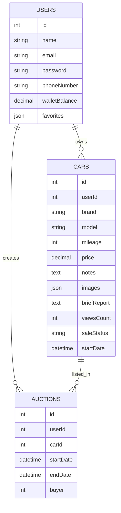

# 🚗 MAZAADY - Car Auction Platform

An **online live auction** platform for buying and selling used cars easily and securely — no need to visit showrooms!  
The platform ensures **trust**, **transparency**, and **a complete digital experience** for all parties.

---

## STAGE 3:

## User Stories (MoSCoW Prioritized)
###  MUST HAVE :
- As a guest, I want to browse active auctions so that I can explore items before signing up.
- As a guest, I want to view auction details so that I can understand the item, price, and time remaining.
- As a user, I want to register/login securely so that I can participate in auctions.
- As a user, I want real-time bid updates so that I don’t have to refresh the page.
- As a user, I want to view my bidding history so that I can track my activity.
- As a seller, I want to create auctions with photos, description, and minimum bid so that I can sell items.
- As an admin, I want to monitor system activity so that the platform remains safe and controlled.

###  SHOULD HAVE :
- As a user, I want to upgrade to a paid membership so that I can increase my bid limits.

###  COULD HAVE :
- As a seller, I want to edit my auction before it’s approved so that I can correct mistakes.
- As a user, I want to receive SMS/email notifications for being outbid so that I don’t miss chances.

###  WON’T HAVE :
- As a user, I want a live chat system with sellers so that I can ask questions.
- As a user, I want AI-based price predictions so that I know if an item is overpriced.
- As an admin, I want advanced analytics dashboards.

---

## Mockup [FIGMA] :

- https://www.figma.com/design/vZSenpDG4rxb34mGQYkHvC/mockups?node-id=0-1&t=HuItjrpOoIRv5M5y-1

---

## Design System Architecture
- Front-end: Tailwind CSS.
- Back-end: Django.
- Database: MySQL.
- External APIs: Moyasar for payment gateway.

  

---

# Backend Key Classes, Attributes, and Methods

## 1. User Class

### Attributes
- `id`
- `name`
- `email`
- `password`
- `phoneNumber`
- `walletBalance`
- `favorites` (list of Car IDs)
- `cars` (list of Car objects)

### Methods
- `register()` — Create a new user account  
- `login()` — Authenticate user  
- `updateProfile(data)` — Update user info  
- `addFavorite(carId)` — Add car to favorites  
- `removeFavorite(carId)` — Remove from favorites  
- `depositToWallet(amount)` — Add money to wallet  
- `withdrawFromWallet(amount)` — Withdraw money  
- `listCars()` — Return all cars owned by user  


---

## 2. Car Class

### Attributes
- `id`
- `userId`
- `brand`
- `model`
- `mileage`
- `price`
- `notes`
- `images` (array of image paths)
- `briefReport`
- `viewsCount`
- `saleStatus` (available / sold)
- `startDate`

### Methods
- `create()` — Add a new car  
- `update(data)` — Edit car information  
- `addImages(images)` — Upload images  
- `increaseViews()` — Increment views  
- `markAsSold(buyerId)` — Mark car as sold  
- `getOwner()` — Return car owner  
- `startAuction(auctionData)` — Create auction for this car  


---

## 3. Auction Class

### Attributes
- `id`
- `userId` (auction creator)
- `carId`
- `startDate`
- `endDate`
- `buyer` (nullable until auction ends)

### Methods
- `start()` — Start the auction  
- `end()` — Close auction and determine winner  
- `placeBid(userId, amount)` — Add a bid  
- `getHighestBid()` — Return highest bid  
- `assignBuyer(userId)` — Set the winning buyer  
- `getCar()` — Get car for this auction  
- `getAuctionOwner()` — Return the creating user


# ER Diagram (Mermaid)


---

# Sequence Diagrams
## User Registration
```
sequenceDiagram
    actor User
    participant Frontend as Front-End (App/Web)
    participant Backend as Backend (API)
    participant DB as Database

    User ->> Frontend: Open registration form
    User ->> Frontend: Enter name, email, password, phone
    Frontend ->> Backend: POST /register (user data)

    Backend ->> Backend: Validate input
    Backend ->> DB: Check if email already exists
    DB -->> Backend: Email OK

    Backend ->> Backend: Hash password
    Backend ->> DB: Insert new user record
    DB -->> Backend: User created

    Backend -->> Frontend: Registration success (user object + token)
    Frontend -->> User: Show welcome/confirmation screen

```

## User Places a Bid on a Car
```
sequenceDiagram
    actor User
    participant Frontend as Front-End (App/Web)
    participant Backend as Backend (API)
    participant AuctionSrv as Auction Service
    participant DB as Database

    User ->> Frontend: Enter bid amount
    Frontend ->> Backend: POST /auction/{id}/bid (amount)

    Backend ->> AuctionSrv: Validate auction + bid amount
    AuctionSrv ->> DB: Get auction details
    DB -->> AuctionSrv: Auction data

    AuctionSrv ->> DB: Get current highest bid
    DB -->> AuctionSrv: Highest bid returned

    AuctionSrv ->> AuctionSrv: Compare new bid > highest bid
    AuctionSrv ->> DB: Insert new bid record
    DB -->> AuctionSrv: Bid saved

    AuctionSrv -->> Backend: Bid accepted
    Backend -->> Frontend: Bid confirmed (new bid info)
    Frontend -->> User: Show updated highest bid


```

---
## External APIs

- Payment Gateway (Moyasar)

Purpose: Wallet top-ups, auction payment processing.

Reason for Choice: Secure, PCI-compliant, widely supported


## User Registration API

POST /api/register

Input (JSON)
{
  "name": "John Doe",
  "email": "user@example.com",
  "password": "123456",
  "phone": "+966500000000"
}

Output (JSON)
{
  "success": true,
  "message": "User registered successfully",
  "data": {
    "id": 12,
    "name": "John Doe",
    "email": "user@example.com",
    "phone": "+966500000000",
    "token": "jwt_token_here"
  }
}

## User Login API

Endpoint
POST /api/login

Input
{
  "email": "user@example.com",
  "password": "123456"
}

Output
{
  "success": true,
  "token": "jwt_token_here"
}

## List Cars

Endpoint
GET /api/cars

Output
[
  {
    "id": 1,
    "brand": "Toyota",
    "model": "Camry",
    "price": 35000
  }
]


---

## Plan for SCM and QA Strategies :
### SCM:
- Use Git & Github for efficient workflow
- Correctly writing commit messages
- use git flow to manage branches
### QA:
- Test individual system functions using framework tool
- Test groups of systems using pytest
- Test API using Postman

---

⭐ *If you like this project, don’t forget to star the repo!*
